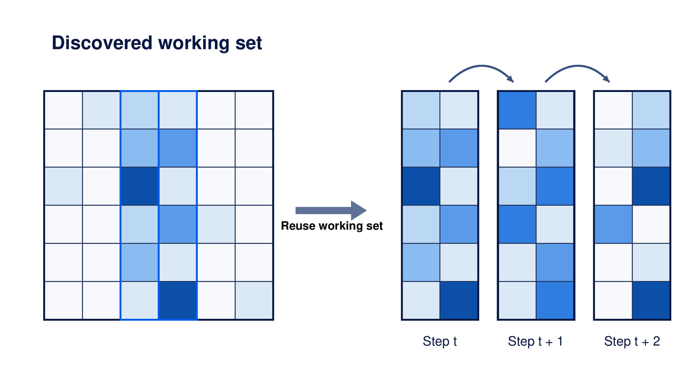
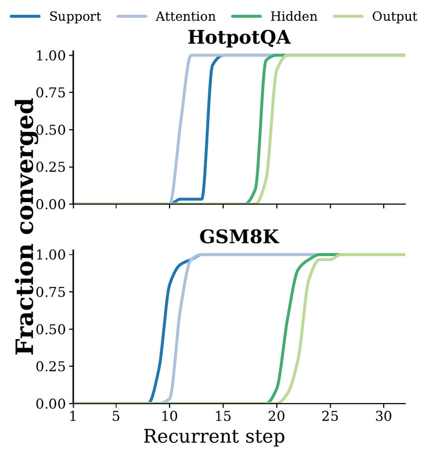

<h1 align="center">WISE</h1>
<p align="center"><strong>Working-set Inference with Support Exploitation</strong></p>
<p align="center"><em>Attention Routing Stabilizes Early: Working-Set Inference for Recurrent Language Models</em></p>
<p align="center"><strong>Discover early. Reuse late. Keep refining.</strong></p>

<p align="center">
  <a href="https://arxiv.org/abs/2609.27373">Paper (arXiv)</a> ·
  <a href="#quick-start">Quick start</a> ·
  <a href="#reproducing-the-paper">Reproduce results</a> ·
  <a href="#gpu-attention-benchmark">GPU benchmark</a> ·
  <a href="docs/REPRODUCING.md">Full documentation</a>
</p>

WISE is a training-free inference method for recurrent language models. It observes that attention **routing support can stabilize before the representations being refined**. Rather than repeatedly searching the entire context, WISE discovers a block-structured working set during early recurrent steps and reuses **only its support** later; hidden states, Q/K/V, and within-support attention weights remain dynamic.

**Paper:** [*Attention Routing Stabilizes Early: Working-Set Inference for Recurrent Language Models*](https://arxiv.org/abs/2609.27373) — **Ke Wan and Chen Chen**, arXiv:2609.27373 (2026). [PDF](https://arxiv.org/pdf/2609.27373)

## How WISE works

<p align="center"></p>

The default configuration is fixed across the primary paper experiments:

| Stage | Recurrent steps | Computation |
|:--|:--|:--|
| Discovery | 1–12 | Unrestricted global attention; directly select block-level cumulative-mass supports at steps 9–12. |
| Working-set construction | End of step 12 | Union of supports from steps 9–12, using **B = 32** and **η = 0.95**. |
| Reuse | 13–32 | Keep the discovered block support fixed, while continuing full recurrent depth and dynamic within-support attention. |

This is **support reuse**, not a frozen attention distribution, a token-level mask rounded to blocks, or early stopping.

## Why it works

<p align="center"></p>

Across HotpotQA and GSM8K mechanism diagnostics, routing-related quantities stabilize earlier than hidden states and attention outputs. The within-routing ordering is task dependent. The plotted diagnostic token support is distinct from WISE's deployed block support; the paper validates that block support separately.

## Results at a glance

| Result | Measurement |
|:--|:--|
| HotpotQA, N=100 | Full **0.2263** F1; WISE **0.2317** F1 |
| 2WikiMultihopQA, N=100 | Full **0.2516** F1; WISE **0.2497** F1 |
| 4K late-reuse attention workload, RTX A6000 | **1.76×** versus native dense FlashAttention |
| Full T=32 attention trajectory, RTX A6000 | **1.36×** attention-workload speedup, including discovery |

**Scope:** These timing numbers refer to measured **attention workloads**, not end-to-end model inference. The 4K HotpotQA context-scaling cohort shows a measurable quality cost; see the paper and `results/` for the complete quality–efficiency tradeoff. The full canonical timing fixtures are not included in this lightweight repository.

## Repository map

| Directory | Contents |
|:--|:--|
| [`wise/`](wise/) | Working-set discovery, recurrent routing, interventions and reference model adapters |
| [`wise/kernels/`](wise/kernels/) | Exact-B32 Triton kernel and GPU-resident sparse schedule |
| [`scripts/`](scripts/) | Input preparation, behavioral and mechanism evaluation, timing, plots and tables |
| [`configs/`](configs/) | Pinned public Huginn and Recurrent-Llama configurations |
| [`manifests/`](manifests/) | Fixed evaluation cohorts and prompt-hash checks, without licensed dataset text |
| [`results/`](results/) | Compact paper summaries, provenance and a separately labeled η-sensitivity summary |
| [`tests/`](tests/) | CPU-side correctness tests and optional CUDA/Triton test |
| [`assets/`](assets/) | Original vector PDFs and PNGs of the paper's mechanism and method diagrams |

## Quick start

Python 3.10+; a CUDA-enabled PyTorch environment is required for model runs and sparse-kernel benchmarks. CPU support tests do not require a GPU.

```bash
python -m venv .venv
source .venv/bin/activate
python -m pip install -e '.[test,plots]'
python -m pytest -q tests
python examples/minimal_wise_example.py
```

See [the full reproduction guide](docs/REPRODUCING.md) for public checkpoint revisions, dataset formats, fixed cohort verification, commands and hardware assumptions. Loading public Hugging Face checkpoints uses `trust_remote_code=True`; review third-party code and licenses before running it.

## Reproducing the paper

The release contains executable references for **Full**, **Static-95**, **MassMatched**, **SizeMatched**, **Freeze-A@12**, **Truncate@12**, and **WISE**, plus mechanism diagnostics and cross-backbone replication. The data-preparation scripts validate public-dataset exports against the exact cohort IDs and prompt hashes; full inference runs are computationally expensive.

After preparing the locked JSONL inputs following [the reproduction guide](docs/REPRODUCING.md):

```bash
python -m scripts.run_causal_controls \
  --inputs outputs/primary_200.jsonl \
  --output outputs/causal_controls.jsonl \
  --methods Full Static-95 MassMatched SizeMatched Freeze-A@12 Truncate@12 WISE

python -m scripts.run_mechanism \
  --inputs outputs/mechanism_60.jsonl \
  --output outputs/mechanism_trajectories.jsonl

python -m scripts.reproduce_tables
python -m scripts.reproduce_figures --output-dir outputs/figures
```

The included `results/eta_sensitivity_summary.csv` records the later N=100 threshold sweep for η ∈ {0.90, 0.95, 0.99}; it is a compact **reported result**, not a substitute for its unbundled per-example outputs. All other experimental reference scripts retain their frozen paper defaults.

## GPU attention benchmark

The sparse kernel targets the **exact B32 fixed-support** workload on NVIDIA Ampere. A saved, verified canonical-style Q/K/V and support-layout fixture is required for a measured workload comparison; the large paper-specific tensor fixture is **not bundled**.

```bash
python -m pip install -e '.[systems,test]'
python -m pytest -q tests/test_sparse_attention.py
python -m scripts.benchmark_attention \
  --fixture /path/to/verified_fixture.pt \
  --output outputs/attention_passes.csv \
  --gpu 0 --passes 10
```

Do **not** substitute random Q/K/V and label the result a reproduction of the paper's reported acceleration. See [systems reproduction details](docs/REPRODUCING.md#ampere-sparse-attention-benchmark) and [`results/PROVENANCE.md`](results/PROVENANCE.md).

## Citation and license

If you use WISE, please cite our [arXiv preprint](https://arxiv.org/abs/2609.27373). A machine-readable citation is available in [`CITATION.cff`](CITATION.cff).

```bibtex
@misc{wan2026wise,
  title        = {Attention Routing Stabilizes Early: Working-Set Inference for Recurrent Language Models},
  author       = {Wan, Ke and Chen, Chen},
  year         = {2026},
  eprint       = {2609.27373},
  archivePrefix = {arXiv},
  url          = {https://arxiv.org/abs/2609.27373}
}
```

Code is distributed under the [MIT License](LICENSE). Model checkpoints, model remote code, and public datasets retain their original third-party terms.
